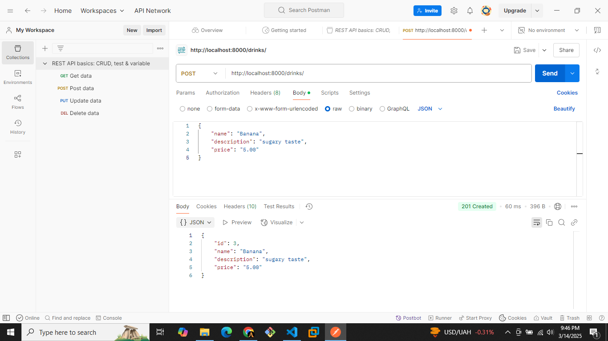

## Django REST API

```bash
python --version
python -m venv .my_env1
source .my_env1/Scripts/activate
pip install django djangorestframework
django-admin startproject drinks .
python manage.py migrate
python manage.py createsuperuser
python manage.py runserver
```

Visit `localhost:8000/admin`

```bash
python manage.py makemigrations drinks
python manage.py migrate
```

Send a `POST` request through `POSTMAN`
```json
{"name": "Banana", "description": "sugary taste", "price": "5.00"}
```

---


```bash
pip install requests
python consume.py
pip freeze > requirements.txt
```


