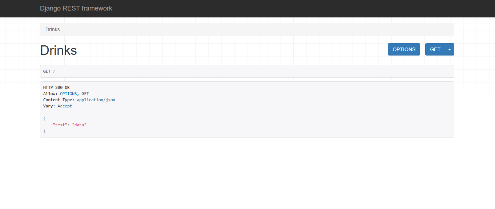

## NoSQL (Dynamodb) REST API

**Prerequisite:**
- Configure `aws` cli locally

```bash
python -m venv .my_env2
. .my_env2/Scripts/activate
pip install djangorestframework
django-admin startproject drinks .
python manage.py migrate
python manage.py runserver
```

Visit `localhost:8000/`



```bash
# Setup the dynamodb on your Aws account 
pip install boto3
# python manage.py makemigrations drinks
pip freeze > requirements.txt
```
```


