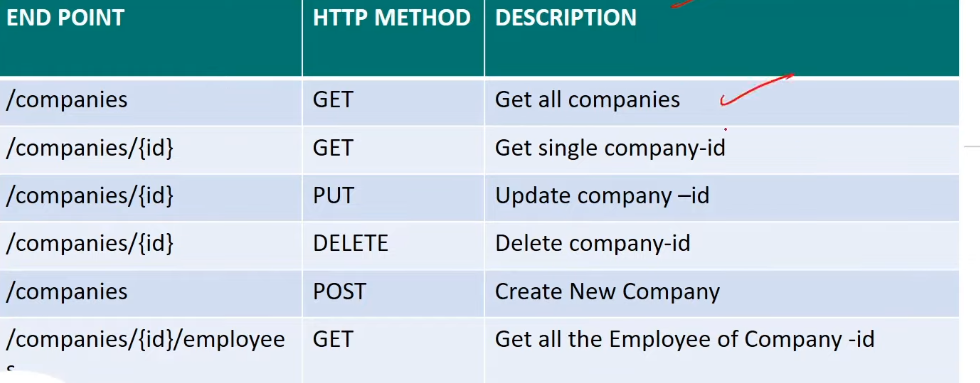
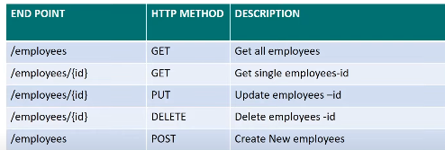

# Company/Employee API

```bash
python -m venv .venv
. .venv/Scripts/activate

pip install django djangorestframework
pip freeze > requirements.txt

django-admin startproject companyapi
cd companyapi/
python manage.py startapp api

python manage.py createsuperuser
python manage.py makemigrations
python manage.py migrate
python manage.py runserver
```

**URLS:**
- `localhost:8000/`
- `localhost:8000/admin`
- `localhost:8000/api/vi/companies`
- `localhost:8000/api/vi/companies/1`
- `localhost:8000/api/vi/companies/2`
- `localhost:8000/api/vi/employees`
- `localhost:8000/api/vi/employees/1`
- `localhost:8000/api/vi/companies/1/employees`






